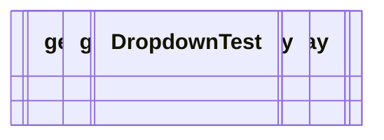

```mermaid
classDiagram
  class app {
  }
  class CalibrationScreen {
  }
  class HomeScreen {
  }
  class MainChart {
  }
  class MainScreen {
  }
  class ScanScreen {
  }
  class arrayToCSV {
  }
  class arrayToJSON {
  }
  class calcSlopeIntercept {
  }
  class calculateRSquared {
  }
  class convertFromArray {
  }
  class downloadFile {
  }
  class Package-level declarations {
  }
  class linearRegression {
  }
  class line_names {
  }
  class openDownloadedFile {
  }
  class rememberLegend {
  }
  class rememberStartAxisLabel {
  }
  class str {
  }
  class AppDatabase {
  }
  class commodityDao {
  }
  class dataValueDao {
  }
  class mrlDao {
  }
  class pesticideDao {
  }
  class AppViewModel {
  }
  class onCreate {
  }
  class viewModelStore {
  }
  class Commodity {
  }
  class id {
  }
  class name {
  }
  class getAll {
  }
  class getCommodity {
  }
  class CommodityDao {
  }
  class insert {
  }
  class DataValue {
  }
  class concentration {
  }
  class voltage {
  }
  class deleteAll {
  }
  class getConcentrationArray {
  }
  class getFromId {
  }
  class getFromVoltage {
  }
  class getVoltageArray {
  }
  class DataValueDao {
  }
  class isEmpty {
  }
  class Detail {
  }
  class mrls {
  }
  class pesticide {
  }
  class DetailDeserializer {
  }
  class deserialize {
  }
  class entries {
  }
  class Formats {
  }
  class toFormat {
  }
  class valueOf {
  }
  class values {
  }
  class CSV {
  }
  class Companion {
  }
  class toList {
  }
  class Excel {
  }
  class JSON {
  }
  class MRL {
  }
  class commodity {
  }
  class mrlID {
  }
  class mrl {
  }
  class getMRL {
  }
  class getMRLs {
  }
  class MRLDao {
  }
  class MRLDetail {
  }
  class MainActivity {
  }
  class MainViewModel {
  }
  class allData {
  }
  class calibrationConcentration {
  }
  class fetchData {
  }
  class getPesticideData {
  }
  class gradient {
  }
  class intercept {
  }
  class r2score {
  }
  class repository {
  }
  class resetValues {
  }
  class screen {
  }
  class theValue {
  }
  class updateConcentration {
  }
  class updateData {
  }
  class updateGradientIntercept {
  }
  class updateR2Score {
  }
  class url {
  }
  class MainViewModelFactory {
  }
  class create {
  }
  class Pesticide {
  }
  class getPesticide {
  }
  class PesticideDao {
  }
  class PesticideDeserializer {
  }
  class PesticidesResponse {
  }
  class pesticides {
  }
  class Repository {
  }
  class Routes {
  }
  class CALIBRATION {
  }
  class HOME {
  }
  class IP_SCANNER {
  }
  class MAIN {
  }
  class Pink40 {
  }
  class Pink80 {
  }
  class PurpleGrey40 {
  }
  class PurpleGrey80 {
  }
  class Purple40 {
  }
  class Purple80 {
  }
  class Typography {
  }
  class WifigetdataTheme {
  }
  class ComposedLineChartCollapsed {
  }
  class ComposedLineChart {
  }
  class LineChartDark {
  }
  class RegularLineChartCollapsed {
  }
  class RegularLineChartExpanded {
  }
  class RegularLineChart {
  }
  class generateFile {
  }
  class goToFileIntent {
  }
  class getCalibrationConcentration {
  }
  class getConcentrationDataArray {
  }
  class getGradient {
  }
  class getIntercept {
  }
  class getR2Score {
  }
  class getReceivedVal {
  }
  class getURL {
  }
  class getUpdateTiming {
  }
  class getVoltageDataArray {
  }
  class BasicValues {
  }
  class receivedVal {
  }
  class setGradient {
  }
  class setIntercept {
  }
  class setR2Score {
  }
  class setReceivedVal {
  }
  class setURL {
  }
  class DropdownTest {
  }
```